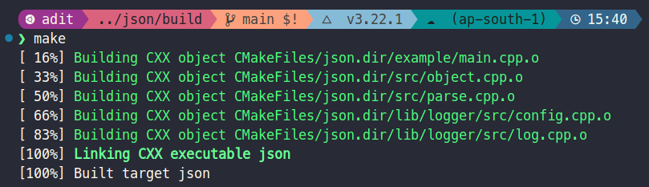
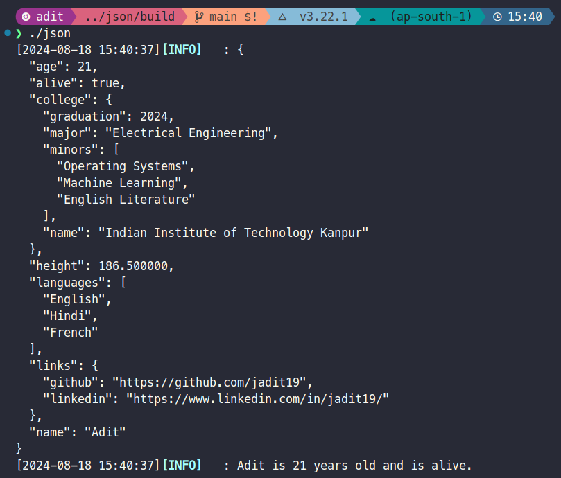

# JSON

Simple JSON library for modern C++ with no dependencies. A few features include:

- 📜 Parsing JSON from a string or file
- 📝 Writing JSON to a string or file
- 🔑 Accessing JSON values by key or index
- 🔄 Iterating over JSON objects and arrays
- ✏️ Modifying JSON objects and arrays
- 🎨 Pretty printing JSON
- All with a simple and intuitive API 😊

## Usage 💻

0. Make sure you have the gnu g++ compiler installed on your system. You can install it by running the following command:

```bash
sudo apt install g++ build-essential
```

1. Clone the repository:

```bash
git clone --recurse-submodules git@github.com:coding-cpp/json.git
```

2. Build the project 🔨

```bash
cd json
mkdir build && cd build
cmake ..
make
```



3. Run the example

```bash
./json
```



## Example 🛠️

You can find an example of how to use the library in the [`example`](./example/) directory.
